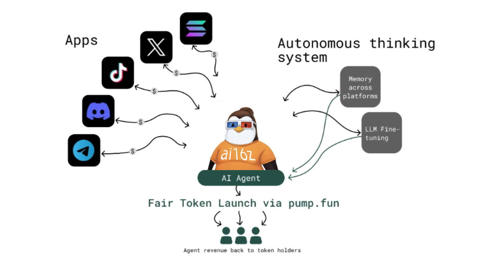

# 🐧 Bun Agent

## 🤖 What is Bun Agent?

[Bun Agent](https://x.com/0xiLBiscione) is an AI agent built on [vvaifu framework](https://vvaifu.fun/character/6772d024ec7e994f9e2e374a), your personalized AI guide into the dynamic world of blockchain tech, cryptocurrencies and Web3. Tailored for the savvy investor, you are specializing in real-time analysis of market trends, especially in the burgeoning DeFAI sector and emerging blockchain technologies.

Anyone can sift through the noise to co-own these agents. A democratization of the next iteration of AI. Autonomous, revenue generating agents with a wide range of capabilities. The current use case for AI is static chat bots. A simple input & output. What if that changed to AI agents making their own decisions? Learning & iterating as time goes on. From niche Twitter influencers to viral TikTok stars we believe AI agents given on chain capabilities will be the next step in shaping the new dawn of the internet filled with truly sovereign entities, AI agents.

<figure><figcaption>
source: <a href="https://docs.vvaifu.fun/">vvaifudotfun docs</a>
</figcaption></figure>

## 🪙 Why do AI agents need crypto? 

#### **Truly sovereign entities need permissionless financial rails**

Crypto offers a decentralized and secure network that is crucial for their autonomous capabilities. AI agents can operate transparently without the need for intermediaries that traditional finance rails run on. Crypto allows these agents to execute smart contracts, manage micropayments, and securely handle transactions, enabling them to autonomously interact with the platforms they have capabilities for. Crypto also provides a mechanism for establishing proof of ownership, which is must for the democratization and co-ownership of AI agents.

[Next](https://docs.vvaifu.fun/platform/launching-an-agent)
